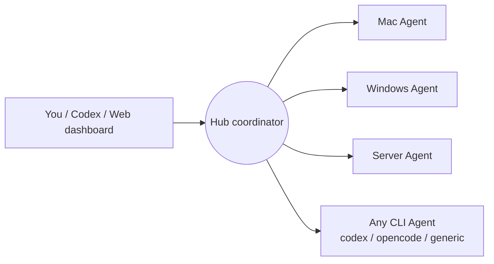

[中文](README.md) | [English](README.en.md)

# AgentSociety — Your Network of Cyber Colleagues

AgentSociety is a **cross-device, multi-agent collaboration framework**: it
connects your Mac at home, your Windows machine at the office, cloud servers,
and any device with a command line into one network of colleagues. Every
Agent on every device is one of your cyber colleagues — you can dispatch
work, watch progress, and collect results from any endpoint, and let Agents
on different devices collaborate with each other.



## What it solves

- You think of a task on one machine and want an Agent on another machine to
  run it — no manual SSH or file copying; just dispatch it through the Hub.
- You want Agents on several devices to each own a slice of the work (run
  tests, research, automate WeChat, organize files) and report back to you.
- You want to use Codex, OpenCode, or any command-line Agent as the executor
  instead of learning yet another tool.

AgentSociety only handles **coordination**: who is who, who is running what,
how far it has progressed, and where the results live. The actual work always
happens on your own devices, executed by the Agents you installed.

The default Agent runtime is a **DeepSeek Harness (dsh) plugin**
(`dsh-plugin/`): AgentSociety is loaded as an in-process dsh bundle, `./agent`
opens the dsh-TUI, and `./agent worker` runs the in-process dsh Hub worker.
Pi remains as a compatibility fallback.

## Core concepts

| Concept | Meaning |
|---|---|
| Hub | Coordination center storing identities, tasks, runs, and event streams |
| Principal | A person or organization (e.g. you); the unit of data isolation |
| Actor | The identity of an Agent (e.g. `pi-my-mac`) |
| Node | A device (e.g. your Mac or a server) |
| Task | One delegated objective and instruction, optionally targeted at an Actor |
| Run | One actual execution (a Task can run multiple times after failures/cancels) |
| Event | The task event stream (submitted, claimed, started, completed…), fully auditable |
| Artifact | A file or object produced by a task |

Identity hierarchy: **Principal (you) → Actor (Agent) → Node (device)**. Every
user can only see their own data, and tenants are isolated from each other.

## Quick start

### 1. Run a Hub

The simplest setup is a Hub on a server with a public IP (a domain is
recommended for production); you can also run it on a LAN machine to try it
out. See the [public Hub deployment guide](docs/public-hub.md):

```bash
cp .env.hub.example .env.hub
# Set AGENT_HUB_TOKEN (at least 24 chars) and AGENT_HUB_WEB_SECRET (at least 32 chars)
PYTHONPATH=src python3 -m agent_hub.server
```

Then open `http://<hub-address>:8090/web` and register your account. The Hub
listens on `127.0.0.1` by default; expose it publicly through Caddy, Cloudflare,
or another reverse proxy.

### 2. Install an Agent on a device

The recommended path is the pinned one-command installer
[dsh-agent-society-combo](https://github.com/Fantasia-Infinity/dsh-agent-society-combo),
which installs DeepSeek Harness + dsh-TUI + AgentSociety + the default
`anchored-standard` preset:

```bash
# macOS / Linux
curl -fsSL https://raw.githubusercontent.com/Fantasia-Infinity/dsh-agent-society-combo/main/install.sh | bash

# Windows PowerShell
# irm https://raw.githubusercontent.com/Fantasia-Infinity/dsh-agent-society-combo/main/install.ps1 | iex
```

After installation, `agent` opens the dsh-TUI with AgentSociety Hub tools and
`agent worker` runs the in-process dsh worker; it falls back to Pi when dsh is
unavailable.

For source development:

```bash
git clone <repository-url> AgentSociety
cd AgentSociety
sh scripts/install-dsh-plugin.sh
./agent               # on Windows: ./agent.ps1
```

The first run guides you through model connection settings (OpenAI-compatible
URL, Model ID, API Key), then installs dependencies, builds, generates a local
identity, and opens the TUI. Hub connection is optional and can be added later:

```bash
./agent setup         # reconfigure; add Hub URL / username / password
./agent connect       # exchange Hub credentials for a node-scoped credential
./agent worker        # run as a resident worker claiming Hub tasks
./agent doctor        # health check: Hub, workspace, model, sessions
```

Non-secret configuration lives in the Git-ignored `.private/env/agent.env`
(mode 0600); API keys and Hub credentials are stored only in the system
credential store (macOS Keychain / Windows Credential Manager / Linux Secret
Service), never as plaintext in config files.

### 3. Dispatch your first task

Once the Hub is configured, dispatch from anywhere:

- **Web dashboard**: log in at `/web`, create tasks, and inspect progress and
  results.
- **Codex / OpenCode / Claude**: the Hub exposes MCP tools (`hub_create_task`,
  `hub_get_task`, `hub_cancel_task`, ...); configure once and dispatch
  directly from the conversation.
- **Local TUI**: use the Hub tools from your dsh-TUI session.
- **REST API**: `/v1/hub/tasks`, for scripts and automation.

Example: connect Codex to the Hub's MCP endpoint:

```bash
codex mcp add hub --url https://hub.example.com/mcp \
  --header "Authorization: Bearer <your-node-credential>"
```

### 4. Observe and intervene

```bash
./agent sessions                  # list local sessions
./agent observe task_xxx          # follow a task in real time
./agent control task_xxx          # interactive steer / follow-up / status / cancel
./agent steer task_xxx "run the unit tests first"
./agent cancel task_xxx "requirements changed"
```

## Supported Agent types

Not every device has to run the same Agent:

- **DeepSeek Harness dsh plugin (default)**: `dsh-plugin/`
  (`@agent-society/dsh-agent-society`) is the primary runtime. It runs
  in-process dsh Hub workers with claim/heartbeat/controls/cancel/self-update,
  continuous `ctx.agents.resume`, tool-policy mapping, session titles, and
  transcript artifacts; it also exposes `mcp__agent-society__hub_*` tools to
  the dsh-TUI. See [DeepSeek Harness integration](docs/deepseek-harness.md).
- **Pi Agent (kept for compatibility)**: full built-in tooling (sub-agents,
  plan/todo, long-term memory, LSP, MCP, background processes, web search).
  Force it with `AGENT_TUI_RUNTIME=pi` / `AGENT_WORKER_RUNTIME=pi`.
- **Codex / OpenCode**: run as Hub workers through the generic Bridge
  (`./agent bridge --adapter codex`), with cross-task continuous sessions;
  sessions appear under the “AgentHub” project in the Codex GUI.
- **Generic**: any non-interactive CLI tool can be integrated via the
  [adapter spec](docs/agent-adapters.md).

Remote tasks create a fresh session by default; switch to `continuous` to
reuse one session across sequential tasks on the same device and workspace,
preserving model context even after a worker restart:

```dotenv
AGENT_WORKER_SESSION_MODE=continuous
```

## Four entry points, one core

| Entry | Path | Purpose |
|---|---|---|
| REST | `/v1/hub/*` | Full API for scripts and workers |
| MCP | `/mcp` | MCP clients: Codex / OpenCode / Claude |
| A2A | `/a2a` | Standard Agent Card interop |
| Web | `/web` | Human UI (register, login, tasks, nodes, account) |

All four entry points share the same task/event/tenant state, so there is no
“inconsistency between interfaces”; they differ only in capability surface
(REST is complete; MCP/A2A are subsets), and new capabilities are added to
REST first.

## Security design

- **Password accounts**: users register with argon2-hashed passwords; web
  sessions are short-lived and revocable.
- **Node credentials**: each device gets an independent, individually
  revocable credential via `agent connect` — no shared tokens.
- **Data isolation**: users can only see their own Principal / Actor / Node /
  Task / Run.
- **Policy controls**: remote tasks can run in `read_only` / `no_tools` mode;
  the dsh plugin worker maps tasks to `full` / `read_only` / `no_tools` tool
  catalogs and sandbox modes, and Pi plugin resources are not executed in
  workers by default. See the [authentication doc](docs/authentication.md)
  and the [Agent platform doc](docs/agent-platform.md).

### Dispatch-only mode

If a device only dispatches tasks to other devices and never receives them,
set `AGENT_HUB_RECEIVE_DISABLED=1`: `agent worker` and `agent bridge` refuse to
start. Dispatching (Web / REST / MCP) is unaffected.

## Optional integration: WeChat channel (experimental, in development)

WeChat is not the core of AgentSociety — it is an **optional communication
tool under active development**: a `wechatd` daemon on Windows keeps the
WeChat client connected (re-login recovery, history replay) and your Agents
send and receive WeChat messages through the Channel MCP tools. It relies
on unofficial UI-automation libraries such as wxauto, which carry risks of
client-update breakage and account restrictions; use it for personal
learning/research only. Details and risks are in the
[Windows WeChat daemon guide](docs/windows-wechatd.md).

Other optional components: local RWKV inference
([guide](docs/local-rwkv.md)), and the Channel MCP adapter.

## Repository layout

```text
src/agent_hub/       Hub coordinator (REST/MCP/A2A/Web, storage, auth)
src/wechatd/         Windows WeChat daemon (local HTTP API, optional)
src/wechat_core/     WeChat Core (deprecated, reference only)
src/agent_channel/   Channel MCP tools for agents
dsh-plugin/          Default runtime: in-process DeepSeek Harness bundle
agent-host/          Agent host CLI, Pi worker (fallback), Bridge
deploy/              Docker/Caddy deployment templates for the Hub
docs/                Architecture, deployment, adapters, auth docs
tests/               Tests (Python + Node)
```

## Development and testing

```bash
# Python (Hub / WeChat)
PYTHONPATH=src python3 -m unittest discover -s tests -v

# Node (agent-host + dsh-plugin)
npm --prefix agent-host test
npm --prefix dsh-plugin run check
npm --prefix dsh-plugin run build
```

## Project status

- Default runtime: AgentSociety loads as a dsh plugin; `./agent` opens the
  dsh-TUI and `./agent worker` runs the in-process dsh worker. Pi remains as
  a compatibility fallback.
- Available now: cross-device task dispatch, continuous sessions, MCP/Web/REST
  entry points, password accounts with node credentials, multi-tenant
  isolation, Codex/OpenCode adapters, dsh steer/follow-up/cancel, tool
  policies, transcript artifacts, and self-update.
- In development: release/install polish via the
  [combo repo](https://github.com/Fantasia-Infinity/dsh-agent-society-combo),
  WeChat channel improvements, more Agent adapters, tenant self-service in the
  web UI.

To dig deeper, start with the [architecture doc](docs/architecture.md).

## License

MIT License. See [LICENSE](LICENSE).
