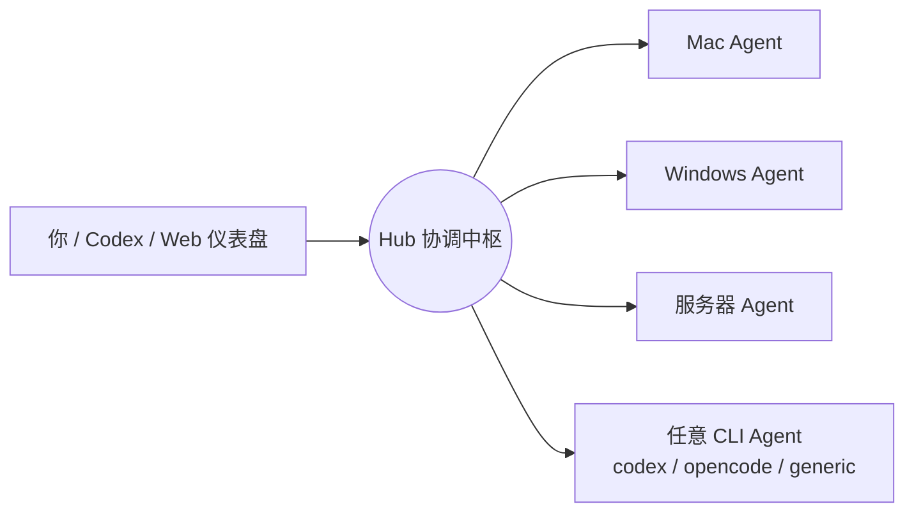

# AgentSociety —— 你的赛博同事网络

AgentSociety 是一个**跨设备、多 Agent 协作框架**：把家里的 Mac、办公室的
Windows、云上的服务器，以及任何带命令行工具的机器，连成一张“同事网络”。
每一台设备上的 Agent 都是你的一名赛博同事——你可以从任何一端派活、看进度、
收结果，也可以让不同设备上的 Agent 互相协作。



## 它解决什么问题

- 你在一台机器上想到一个任务，想让另一台机器上的 Agent 去执行——不用手动 SSH
  或复制文件，在 Hub 上派发即可。
- 你想让多台设备上的 Agent 各自负责一块工作（跑测试、查资料、操作微信、整理
  文件），最后把结果汇总给你。
- 你想用 Codex、OpenCode 或任意命令行 Agent 作为执行端，而不是重新学一套新工具。

AgentSociety 只负责**协调**：谁是谁、谁在跑什么、跑到哪一步、结果放在哪里。
真正的“干活”始终发生在你自己的设备上，由你自己安装的 Agent 完成。

## 核心概念

| 概念 | 含义 |
|---|---|
| Hub | 协调中枢，保存身份、任务、运行记录和事件流 |
| Principal | 一个人/组织（比如你），是数据隔离的单位 |
| Actor | 一个 Agent 的身份（比如 `pi-我的mac`） |
| Node | 一台设备（比如你的 Mac 或服务器） |
| Task | 一次委派的目标和指令，可指定给某个 Actor 或按能力匹配 |
| Run | 一次实际执行（Task 可能因失败/取消被多次执行） |
| Event | 任务事件流（提交、认领、开始、完成…），全程可审计 |
| Artifact | 任务产出的文件或对象 |

身份关系：**Principal（你）→ Actor（Agent）→ Node（设备）**。每个用户只
能看见属于自己的数据，不同租户之间互相隔离。

## 快速开始

### 1. 准备一个 Hub

最简单的办法是把 Hub 部署在一台有公网 IP 的服务器上（正式部署建议配一个域名），
也可以先跑在局域网机器上体验。部署步骤见
[Hub 公网部署指南](docs/public-hub.md)：

```bash
cp .env.hub.example .env.hub
# 设置 AGENT_HUB_TOKEN（至少 24 字符）和 AGENT_HUB_WEB_SECRET（至少 32 字符）
PYTHONPATH=src python3 -m agent_hub.server
```

启动后打开 `http://<hub-address>:8090/web` 注册你的账号。Hub 默认只监听
`127.0.0.1`，公网访问通过 Caddy/Cloudflare 等反向代理暴露。

### 2. 在一台设备上安装 Agent

需要 Git 和 Node.js 22.19+（Windows 用 PowerShell）：

```bash
git clone <repository-url> AgentSociety
cd AgentSociety
./agent               # Windows 用 ./agent.ps1
```

首次运行会引导你填写模型连接信息（OpenAI-compatible URL、Model ID、API Key），
然后自动安装依赖、构建、生成本机身份并打开 TUI。Hub 连接是可选的，之后随时
补充：

```bash
./agent setup         # 重新配置，可补填 Hub URL / 用户名 / 密码
./agent connect       # 用 Hub 账号密码换本机节点凭据
./agent worker        # 作为常驻 worker 开始领取 Hub 任务
./agent doctor        # 体检：Hub 连接、workspace、模型、session
```

非敏感配置保存在被 Git 忽略的 `.private/env/agent.env`（权限 0600）；API Key 和
Hub 凭据只存入系统凭据库（macOS Keychain / Windows Credential Manager / Linux
Secret Service），配置文件里没有明文密钥。

### 3. 派发你的第一个任务

配置好 Hub 后，从任何一端都可以派活：

- **Web 仪表盘**：`/web` 登录后创建任务、查看进度和结果。
- **Codex / OpenCode / Claude**：Hub 暴露 MCP 工具（`hub_create_task`、
  `hub_get_task`、`hub_cancel_task` 等），配置后即可直接在对话里派活。
- **本机 TUI**：通过 Hub 工具在对话里派发。
- **REST API**：`/v1/hub/tasks`，适合脚本和自动化。

用 Codex 连接 Hub 的 MCP 示例：

```bash
codex mcp add hub --url https://hub.example.com/mcp \
  --header "Authorization: Bearer <你的节点凭据>"
```

### 4. 观察和干预

```bash
./agent sessions                  # 本机有哪些 session
./agent observe task_xxx          # 跟踪一个任务的实时进度
./agent control task_xxx          # 交互式 steer / follow-up / status / cancel
./agent steer task_xxx "先运行单元测试"
./agent cancel task_xxx "目标已变化"
```

## 支持的 Agent 类型

AgentSociety 不要求所有设备都用同一种 Agent：

- **Pi Agent（默认）**：完整的内建工具（Sub-agent、plan/todo、长期记忆、LSP、
  MCP、后台进程、Web 搜索），支持本机 TUI 和远程任务。
- **Codex / OpenCode**：通过通用 Bridge 作为 Hub worker
  （`./agent bridge --adapter codex`），支持跨任务连续会话，任务会出现在
  Codex GUI 的 “AgentHub” 项目里。
- **Generic**：任何带非交互 CLI 的工具都可以通过
  [适配器规范](docs/agent-adapters.md) 接入。

远程任务默认每次新建独立 session；改成 `continuous` 后，同一台设备同一工作区
的连续任务会复用同一个 session，保留模型上下文，worker 重启后还能恢复：

```dotenv
AGENT_WORKER_SESSION_MODE=continuous
```

## 四种访问入口，一个内核

| 入口 | 路径 | 用途 |
|---|---|---|
| REST | `/v1/hub/*` | 全量 API，脚本和 worker 使用 |
| MCP | `/mcp` | Codex / OpenCode / Claude 等 MCP 客户端 |
| A2A | `/a2a` | 标准 Agent Card 互操作 |
| Web | `/web` | 人类管理界面（注册、登录、任务、节点、账户） |

四个入口共享同一套任务/事件/租户状态，不存在“接口之间不一致”的问题；能力面
不同（REST 全量，MCP/A2A 是子集），新增能力优先扩展 REST。

## 安全设计

- **账号密码**：用户注册后用 argon2 哈希密码登录，Web 会话短期有效、可吊销。
- **节点凭据**：每台设备用 `agent connect` 换取独立、可单独吊销的节点凭据，
  不再使用共享 token。
- **数据隔离**：用户只能看到自己的 Principal / Actor / Node / Task / Run。
- **权限策略**：远程任务可设为 `read_only` / `no_tools`，Pi 插件资源默认
  不在 worker 中执行。详见 [认证文档](docs/authentication.md) 和
  [Agent 平台文档](docs/agent-platform.md)。

## 可选接入：微信通道（实验性，开发中）

微信不是 AgentSociety 的核心，而是**一个正在开发的可选通信工具**：通过 Windows
上的 Gateway + 本机/服务器上的 Core，可以让你的 Agent 收发微信消息。它依赖
wxauto 这类非官方 UI 自动化库，有客户端升级失效和账号风控风险，目前建议只做
个人学习/研究用途。想了解细节和风险，见
[Windows Gateway 指南](docs/windows-gateway.md)。

其他可选组件：本地 RWKV 推理（[指南](docs/local-rwkv.md)）、Channel MCP 通道适配。

## 目录结构

```text
src/agent_hub/       Hub 协调中枢（REST/MCP/A2A/Web、存储、认证）
src/wechat_core/     微信 Core（可选）
src/wechat_gateway/  Windows 微信网关（可选）
agent-host/          Agent 宿主（Pi worker、Bridge、CLI）
deploy/              Hub 的 Docker/Caddy 部署模板
docs/                架构、部署、适配器、认证文档
tests/               测试（Python + Node）
```

## 开发与测试

```bash
# Python（Hub / 微信）
PYTHONPATH=src python3 -m unittest discover -s tests -v

# Node（agent-host）
npm --prefix agent-host test
```

## 项目状态

- 已可用：跨设备任务派发、连续会话、MCP/Web/REST 入口、账号与节点凭据、
  多租户隔离、Codex/OpenCode 适配器。
- 开发中：一键安装与发布、微信通道完善、更多 Agent 适配器、Web 租户自助管理。

想深入了解，从 [架构文档](docs/architecture.md) 开始。
