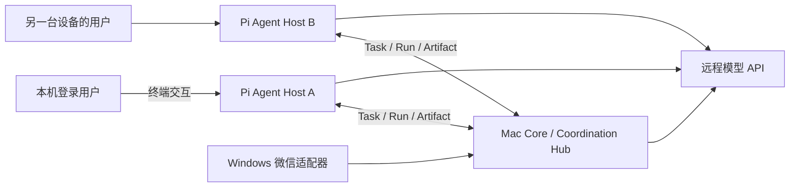

# 基于 Pi 的本地优先 Agent 协作平台

## 已落地的第一条纵切

项目现在不再把“微信机器人”当成最终架构，而是把微信视为一个通信适配器。Mac/服务器
上的 Core 同时提供一个持久化 Coordination Hub；每台设备运行独立的 Pi Agent Host。一个
Host 既可由登录该设备的人直接交互，也可领取其他设备或通信渠道委派的任务。

第一版运行时采用 [Pi SDK](https://pi.dev/docs/latest/sdk)；跨框架互操作方向采用
[A2A Task/Artifact 语义](https://github.com/a2aproject/A2A/blob/main/docs/specification.md)，工具
边界采用 [MCP](https://modelcontextprotocol.io/docs/getting-started/intro)。



当前代码提供：

- `agent_hub`：与模型、通信平台无关的 Principal、Actor、Node、Task、Run、Artifact
  数据模型及 SQLite 持久化状态机。
- `/v1/hub/*`：身份登记、节点心跳、任务创建/查询/领取/更新/取消、Run 和 Artifact API。
- `agent-host`：基于 `@earendil-works/pi-coding-agent` SDK 的 Node 进程。
- 本地入口：一个有持久 Pi session 的交互终端，登录设备的人直接控制。
- 远程入口：worker 长轮询领取任务；每次领取产生单独 Run，使用租约、心跳、幂等任务和
  终态结果。
- Pi Hub 工具：Agent 可列出 Actor/Task、读取 Task、创建子任务。工具定义留在 Pi Adapter，
  核心领域模型不依赖 Pi。

## 通用身份与执行模型

| 对象 | 含义 | 示例 |
| --- | --- | --- |
| Principal | 权利与责任主体，可为人、Agent、服务或组织 | 同一个人在多台设备上的稳定身份 |
| Actor | Principal 当前使用的一个操作角色/Agent 实例 | `pi-macbook`、微信中的人类入口 |
| Node | 可登录、可执行的物理机或虚拟机 | MacBook、Windows 微信机、云服务器 |
| Task | 可委派、可观察、有终态的目标 | 检查仓库并返回测试结果 |
| Run | 一次隔离的执行尝试 | 本地交互 session、远程任务的第 2 次重试 |
| Artifact | Run/Task 产生的可寻址产物元数据 | 文件 URI、摘要、报告、构建物 |

这种建模不会把“Agent 操作人”设为特殊情况。人和 Agent 都通过 Actor 产生消息、委派 Task
或确认结果；差异由能力、授权和审批策略表达。Node 也不等同于 Agent：同一 Node 以后可
运行多个 Actor，一个 Actor 也可以在多个 Node 上有执行实例。

## 两条控制路径

本地路径的授权根是设备的登录用户：本地交互使用指定 workspace，并开放 Pi 的常规
`read/bash/edit/write/grep/find/ls` 工具。session 保存在 `AGENT_SESSION_DIR`，同时在 Hub
记录一个 `origin=local_ui` 的 Run。

远程路径的授权根是 Hub 中的 Task。默认 `AGENT_REMOTE_TOOL_POLICY=read_only`，只向 Pi
开放 `read/grep/find/ls` 和 Hub 协作工具。把它改成 `full` 是显式提升权限，会加入
`bash/edit/write`；设为 `no_tools` 则只保留 Hub 工具。Task 请求的 workspace 必须是
`AGENT_WORKSPACE_ROOT` 的现有子目录，路径逃逸会被拒绝。

注意：Pi 本身不是 OS 沙箱。`read_only` 是工具暴露策略，不应被当成敌对代码隔离。公网
接收不可信任务前，还需要容器/虚拟机、每节点身份和审批策略。

## 任务语义

1. 委派者用 `idempotency_key` 创建 `submitted` Task。
2. 能力满足要求的 Agent Node 原子领取 Task，Hub 返回不可在普通查询中读取的 lease token，
   并创建 `origin=remote_task` 的 Run。
3. worker 定期更新 `working` 事件并续租。租约过期后 Task 可重新领取，旧 Run 标记失败。
4. `completed`、`failed`、`cancelled` 是终态；结果写入 Task 和 Run，事件流保留状态历史。
5. 大产物放文件系统或对象存储，Hub 只保存 URI、媒体类型、大小和 SHA-256 等元数据。

该形状与 A2A 的 Task/Message/Artifact 和任务生命周期兼容，但当前 API 是项目内部最小协议，
尚未宣称为完整 A2A 实现。Pi custom tools 是第一版运行时适配；后续会把同一工具契约导出为
MCP Server，再增加 A2A Agent Card/transport Adapter。这样替换 Pi 或并存其他开源 Agent
框架时不需要迁移 Hub 数据模型。

## 启动

Core 默认继续使用远程 OpenAI-compatible API：

```bash
LLM_BACKEND=remote PYTHONPATH=src python3 -m wechat_bot.api
```

安装并构建 Agent Host：

```bash
cd agent-host
npm ci --ignore-scripts
npm run apply-security-patches
npm run security-check
npm run build
```

Pi 0.83.0 自带 shrinkwrap 固定了存在 OOM DoS 公告的 `brace-expansion 5.0.7`，且 npm
override 无法越过该 shrinkwrap。因此 Host 直接锁定安全版 5.0.9，并用仓库内脚本只覆盖
Pi 的这一份嵌套包；`security-check` 会验证实际运行版本。这里刻意禁用第三方安装脚本，补丁
也不通过隐式 `postinstall` 执行。

Host 默认读取项目根目录 `.env` 中的 `BOT_API_TOKEN`、`LLM_BASE_URL`、`LLM_API_KEY`、
`LLM_MODEL`；可以参照 `.env.agent.example` 覆盖 Agent 配置。模型地址必须是远程 HTTP(S)
地址，loopback 会被拒绝。也可以用 `PI_PROVIDER`/`PI_MODEL` 选择已在 Pi 中配置凭证的远程
Provider。

若 Mac 上的远程 API key 已放在 Login Keychain，可避免把密钥写进 `.env`：

```bash
AGENT_REMOTE_API_KEY_KEYCHAIN_SERVICE=your-keychain-service
AGENT_REMOTE_API_KEY_KEYCHAIN_ACCOUNT="your keychain account"
```

Agent Host 通过参数数组调用系统 `security` 命令，密钥不会进入命令行、Hub、日志或 SQLite。

```bash
# 只登记 Principal / Actor / Node
npm run start -- register

# 本地用户直接操作
npm run interactive

# 领取一个任务，便于调试
npm run start -- once

# 持续领取任务
npm run worker
```

创建一个任务的最小示例：

```bash
curl -X POST http://127.0.0.1:8080/v1/hub/tasks \
  -H "Authorization: Bearer $BOT_API_TOKEN" \
  -H "Content-Type: application/json" \
  -d '{
    "principal_id":"human-owner",
    "delegator_actor_id":"pi-macbook",
    "assignee_actor_id":"pi-server",
    "objective":"运行测试并返回失败摘要",
    "input":{"workspace":"ssh"},
    "required_capabilities":["code"],
    "idempotency_key":"test-2026-08-02-1"
  }'
```

## Hub API

| 方法 | 路径 | 作用 |
| --- | --- | --- |
| POST/GET | `/v1/hub/principals` | 登记/列出主体 |
| POST/GET | `/v1/hub/actors` | 登记/列出 Actor 与能力 |
| POST/GET | `/v1/hub/nodes` | 登记/列出 Node |
| POST | `/v1/hub/nodes/heartbeat` | Node 在线心跳 |
| POST/GET | `/v1/hub/tasks` | 创建/列出 Task |
| GET | `/v1/hub/tasks/{id}` | 读取 Task 与 Artifact |
| GET | `/v1/hub/tasks/{id}/events` | 读取状态事件流 |
| POST | `/v1/hub/tasks/claim` | 按 Actor 能力领取并创建 Run |
| POST | `/v1/hub/tasks/{id}/updates` | 续租、完成或失败 |
| POST | `/v1/hub/tasks/{id}/cancel` | 取消 Task |
| POST | `/v1/hub/runs` | 记录本地/渠道 Run |
| POST | `/v1/hub/runs/{id}/updates` | 更新 Run |
| POST | `/v1/hub/artifacts` | 登记 Artifact 元数据 |

Hub 默认只接受 loopback 客户端；即使 `BOT_API_HOST=0.0.0.0`，局域网请求也会被拒绝。
未设置 `AGENT_HUB_TOKEN` 时它会兼容性复用 Core token；准备可信远程节点时，应先配置独立
token，再显式设置 `AGENT_HUB_ALLOW_REMOTE=true`。这仍不适合直接暴露到公网。公网 Hub
阶段必须替换成逐 Principal/Node 凭证（建议 mTLS 或短期 OIDC token）、细粒度 capability
policy、签名事件、审计保留和密钥轮换。

## 后续实施顺序

1. 把 Hub 从 Core 进程中拆成可独立部署的服务，并迁移到 PostgreSQL/对象存储。
2. 增加逐节点身份、任务授权/审批、撤销、配额以及容器/VM Run Sandbox。
3. 把 Pi Hub tools 和 Windows 微信动作导出为 MCP Server；让 Windows 继续只做薄适配器。
4. 增加 A2A Agent Card、Task/Artifact 映射和流式事件 Adapter，使第三方 Agent 可互操作。
5. 增加公网 relay/消息总线、多 Hub 联邦和离线同步；微信、Slack、自建通信服务都只实现
   Channel Adapter。
6. 增加团队任务图、Artifact lineage、人工确认节点、可观测性与策略回放。
