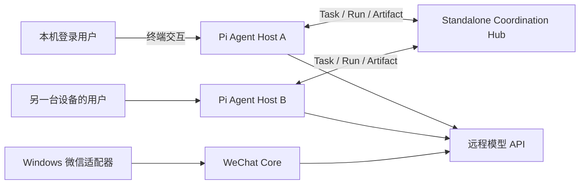

# AgentSociety：基于 Pi 的本地优先 Agent 平台

## 已落地的第一条纵切

项目现在不再把“微信机器人”当成最终架构，而是把微信视为一个通信适配器。Coordination
Hub 已从微信 Core 中拆出，是一个可单独部署的持久服务；每台设备运行独立的 Pi Agent
Host。一个 Host 既可由登录该设备的人通过完整 Pi TUI 直接交互，也可领取其他设备或通信
渠道委派的任务。

第一版运行时采用 [Pi SDK](https://pi.dev/docs/latest/sdk)；跨框架互操作方向采用
[A2A Task/Artifact 语义](https://github.com/a2aproject/A2A/blob/main/docs/specification.md)，工具
边界采用 [MCP](https://modelcontextprotocol.io/docs/getting-started/intro)。



当前代码提供：

- `agent-hub`：独立 HTTP 进程，承载与模型、通信平台无关的 Principal、Actor、Node、
  Task、Run、Artifact 数据模型；默认 SQLite，也可选 PostgreSQL。
- `/v1/hub/*`：身份登记、节点心跳、任务创建/查询/领取/更新/取消、Run 和 Artifact API。
- `agent-host`：基于 `@earendil-works/pi-coding-agent` SDK 的 Node 进程。
- 本地入口：Pi 0.83.0 原生完整 TUI 和 Resource Loader；登录设备的人可以直接操作，
  session 会持久化，已安装 Package 的 Extension 工具、命令、事件、Skill、Prompt 和 Theme
  按 Pi 语义加载。
- 远程入口：worker 长轮询领取任务；支持每 Task 独立 session，也支持每 worker scope 连续、
  持久且跨重启恢复的 Pi session。每次领取始终产生独立 Run，并使用租约、心跳、幂等任务和
  终态结果。
- Pi Hub 工具：Agent 可列出 Actor/Task、读取 Task、创建子任务。工具定义留在 Pi Adapter，
  核心领域模型不依赖 Pi。
- Channel MCP：按 MCP 2025-06-18 暴露 list/read/send/reply/react/download；Windows 继续只
  执行 Core 下发的动作。
- A2A Adapter：`/.well-known/agent-card.json` 与 `/a2a` 提供 A2A 1.0 JSON-RPC 的
  SendMessage、GetTask、ListTasks、CancelTask。
- 通用 Web Search：Pi 始终看到稳定的 `web_search(query)`；当前 provider adapter 通过
  DeepSeek Responses API 强制执行服务端 `web_search`，以后可替换独立搜索后端。
- 托管能力包：所有本地 session 与默认 `full` 远程 worker 都加载相同的 Sub-agent、
  plan/todo、分域长期记忆、LSP/代码索引、MCP 和 session 后台进程工具。

## 通用身份与执行模型

| 对象 | 含义 | 示例 |
| --- | --- | --- |
| Principal | 权利与责任主体，可为人、Agent、服务或组织 | 同一个人在多台设备上的稳定身份 |
| Actor | Principal 当前使用的一个操作角色/Agent 实例 | `pi-macbook`、微信中的人类入口 |
| Node | 可登录、可执行的物理机或虚拟机 | MacBook、Windows 微信机、云服务器 |
| Task | 可委派、可观察、有终态的目标 | 检查仓库并返回测试结果 |
| Run | 一次隔离的执行尝试 | 本地交互 session、远程任务的第 2 次重试 |
| Artifact | Run/Task 产生的可寻址产物元数据 | 文件 URI、摘要、报告、构建物 |

这种建模不会把“Agent 操作人”设为特殊情况。人和 Agent 都通过 Actor 产生消息、委派 Task
或确认结果；差异由能力、授权和审批策略表达。Node 也不等同于 Agent：同一 Node 以后可
运行多个 Actor，一个 Actor 也可以在多个 Node 上有执行实例。

## 两条控制路径

本地路径的授权根是设备的登录用户：本地交互使用指定 workspace，并开放 Pi 的全部内置工具
和 Extension 注册工具。Package 可继续通过 Pi 自己的 CLI 安装，无需 AgentSociety 包装：

```bash
npm --prefix agent-host exec -- pi install npm:<package-name>
npm --prefix agent-host exec -- pi install git:github.com/user/repository@tag
npm --prefix agent-host exec -- pi list
```

Pi 的全局 `~/.pi/agent` 资源直接视为登录用户主动安装的资源；项目 `.pi` 设置、Package 和
Extension 首次加载前必须在 TUI 中明确授信，决定记录在 Pi 的 `trust.json`。未授信项目仍可
使用全局资源和普通上下文文件。session 保存在 `AGENT_SESSION_DIR`，同时在 Hub 记录一个
`origin=local_ui` 的 Run。

远程路径的授权根是 Hub 中的 Task。默认 `AGENT_REMOTE_TOOL_POLICY=full`，向 Pi 开放
`read/bash/edit/write/grep/find/ls` 和 Hub 协作工具；改成 `read_only` 只开放
`read/grep/find/ls` 和 Hub 工具（适合只做检查的 worker）；设为 `no_tools` 则只保留
Hub 工具。Task 请求的 workspace 必须是
`AGENT_WORKSPACE_ROOT` 的现有子目录，路径逃逸会被拒绝。

Hub worker 还独立使用 `AGENT_REMOTE_PI_RESOURCES` 控制用户安装和项目 Package：

- `disabled`（默认）：不加载用户/项目 Extension、Skill、Prompt 或 Theme；AgentSociety 固定版本
  的 MCP/LSP 托管扩展仍会加载。
- `global`：只加载登录用户安装在 `~/.pi/agent` 的资源，不加载任务 workspace 中的 `.pi`。
- `trusted_project`：在 `global` 基础上，仅加载之前由本地 TUI 明确授信的项目资源；worker
  不会在无人值守状态弹出信任确认。

即使选择 `global` 或 `trusted_project`，`read_only`/`no_tools` 仍会过滤 Extension 自定义工具；
只有 `AGENT_REMOTE_TOOL_POLICY=full`（默认）才向远程模型开放这些工具。用户 Extension 的初始化
代码和事件 Hook 不受工具名单约束，因此远程加载 Package 必须是设备所有者的显式选择。

### 远程 worker 的 session 生命周期

`AGENT_WORKER_SESSION_MODE` 提供两个明确模式：

- `per_task`（默认）：每个 Hub Task 新建一个持久 Pi session。隔离最强，旧部署行为不变。
- `continuous`：按 `Actor + Node + Principal + workspace + worker slot` 维护一个连续 session。
  同一 scope 的顺序任务保留对话上下文；不同 Principal、workspace 或并发 slot 绝不共用。

连续映射保存在 `AGENT_SESSION_DIR/agent-host-worker-sessions.d`，不进入 Hub。Pi 会等首次
assistant 回复后才创建 JSONL；因此在首个回复前崩溃只会丢弃一个空 session，已有回复的 session
则会在 worker 重启后恢复。每个新 Task 都向模型注入显式任务信封，并在 JSONL 写入不参与模型
上下文的 start/end 边界。Hub Task/Run 结果和本机 Run registry 同时记录 session ID、复用标志、
worker slot 以及 entry 起止位置，因此 session 连续不等于审计合并。

plan/todo 在连续模式下按当前 Task 分文件，避免上个任务的临时计划污染下一个任务；长期 memory
仍按既定 workspace/principal scope 工作。session-owned 后台进程和模型上下文会随连续 session
保留，直到 worker 停止、scope 切换或 session 轮换。取消只 abort 当前 turn，不销毁连续 session。

可设置 `AGENT_WORKER_SESSION_MAX_TASKS` 或 `AGENT_WORKER_SESSION_MAX_AGE_HOURS` 自动轮换；`0`
表示不启用对应限制。单个 Task 可用 `input.reset_worker_session=true` 在执行前强制轮换。并发 worker
按从 0 开始的 slot 各自持有 session，所以调整 `AGENT_WORKER_CONCURRENCY` 可能改变后续任务命中
的上下文，要求严格线性连续时应保持并发为 1。

托管能力包默认打开，可用 `AGENT_BUILTIN_CAPABILITIES=0` 整体关闭。Sub-agent 最大深度默认 2、
单次并发默认 4；子 session 继承 workspace、模型和工具策略，但只接收父 Agent 明确给出的目标，
不会隐式复制整段聊天。plan/todo 保存在 session 目录；memory 分 workspace 与 principal 两个
scope 保存，删除采用可恢复归档，且工具提示明确禁止写入 token/key。后台进程限制数量、记录私有
日志，并在 owning session 结束时停止，避免远程任务遗留孤儿进程。

注意：Pi 本身不是 OS 沙箱。工具策略是暴露策略，不应被当成敌对代码隔离。`full` 是设备所有者的
默认授权，公网接收不可信任务前，还需要容器/虚拟机、每节点身份和审批策略。第三方 Package 还可能自行
保存凭据；AgentSociety 的系统凭据库保证只覆盖自身 setup 管理的模型 Key 和 Hub token。

## 任务语义

1. 委派者用 `idempotency_key` 创建 `submitted` Task。
2. 能力满足要求的 Agent Node 原子领取 Task，Hub 返回不可在普通查询中读取的 lease token，
   并创建 `origin=remote_task` 的 Run。
3. worker 定期更新 `working` 事件并续租。租约过期后 Task 可重新领取，旧 Run 标记失败。
4. `completed`、`failed`、`cancelled` 是终态；结果写入 Task 和 Run，事件流保留状态历史。
5. 大产物放文件系统或对象存储，Hub 只保存 URI、媒体类型、大小和 SHA-256 等元数据。

内部 `/v1/hub/*` API 仍是 AgentSociety worker 的高效协议；A2A Adapter 把同一状态映射为
Task/Message/Artifact，并明确声明不支持 streaming/push notification。Channel 工具由独立 MCP
stdio server 导出。这样替换 Pi 或并存其他开源 Agent 框架时不需要迁移 Hub 数据模型。

## 启动

先单独启动 Hub：

```bash
cp .env.hub.example .env.hub
# 设置至少 24 字符、且不与微信 Core 共用的 AGENT_HUB_TOKEN
PYTHONPATH=src python3 -m agent_hub.server
```

Hub 默认监听 `127.0.0.1:8090`，状态写入 `hub-state.sqlite3`。微信 Core 是否运行不影响 Hub。
macOS 后台服务模板见 `deploy/macos/com.fantasia.agent-hub.plist.example`；模板从 Login
Keychain 读取 Hub token，避免把凭据写进 plist。
微信 Core 默认继续使用远程 OpenAI-compatible API：

```bash
LLM_BACKEND=remote PYTHONPATH=src python3 -m wechat_core.api
```

## 新设备加入 Hub

唯一系统前置条件是 Git 和 Node.js 22.19+。在 macOS/Linux 上：

```bash
git clone <repository-url> AgentSociety
cd AgentSociety
./agent
```

Windows PowerShell 使用 `./agent.ps1`。引导器只要求输入三项模型信息：

1. OpenAI-compatible 模型 URL。
2. Model ID。
3. Model API key。

Hub URL/token 是同一次引导中的可选项，直接回车即可保持普通 Agent 模式。其余项目自动完成：
依赖安装、安全补丁、TypeScript 构建、稳定本机身份、仓库 workspace、session 目录和 doctor
检查。doctor 使用不暴露任何工具的临时 session，发送一次不含仓库内容的最小模型请求；配置
Hub 时才执行 Hub 注册。成功后首次 `./agent` 会继续打开 Pi 原生 TUI。

Pi 0.83.0 自带 shrinkwrap 固定了存在 OOM DoS 公告的 `brace-expansion 5.0.7`，且 npm
override 无法越过该 shrinkwrap。因此 setup 直接锁定安全版 5.0.9，并用仓库内脚本只覆盖
Pi 的这一份嵌套包；安全检查会验证实际运行版本。这里刻意禁用第三方安装脚本，补丁也不通过
隐式 `postinstall` 执行。

setup 把非敏感配置和凭据引用写入项目根目录 `.env.agent`，Agent Host 会优先自动读取它；
旧 `.env` 仅作为兼容回退。模型地址必须是远程 HTTP(S) 地址，loopback 会被拒绝。Principal 默认为
`human-<登录用户名>`，Actor/Node 根据主机名生成；workspace 自动设为 clone 后的仓库根目录。
可以参照 `.env.agent.example` 覆盖这些高级默认值。

没有 `AGENT_HUB_URL`/`AGENT_HUB_TOKEN` 时，本地 TUI、session 和模型完全独立运行，也不会向
Pi 暴露 Hub 工具。`worker`、`once`、`observe`、`attach`、`register` 是显式协作命令，缺少
Hub 配置时会给出清晰错误。以后需要协作时重新运行 `./agent setup`，补入 Hub 两项即可；
已经配置 Hub 时仍可用 `./agent local` 临时强制脱离 Hub。

setup 输入的 Model API key 和可选 Hub token 会直接写入操作系统安全凭据库：

- macOS 使用 Login Keychain。
- Windows 使用 Credential Manager。
- Linux 使用 Secret Service，需要当前用户会话提供可用且已解锁的 keyring。

`.env.agent` 只记录 credential service/account，不记录秘密本身；凭据不会进入 Hub、日志或
SQLite。系统凭据库不可用或锁定时 setup 会失败，不提供明文文件回退。重新运行 setup 会把
旧 `.env.agent` 中的 `AGENT_REMOTE_API_KEY` / `AGENT_HUB_TOKEN` 迁移到系统凭据库，并从配置
文件中删除。CI 或外部 secret manager 仍可在进程环境中临时注入这些变量，但 setup 永远不会
把它们写入本地文本文件。

```bash
# 本地用户使用 Pi 原生完整 TUI 直接操作
./agent

# 忽略已有 Hub 配置，强制作为普通本地 Agent 启动
./agent local

# 领取一个任务，便于调试
./agent once

# 持续领取任务
./agent worker

# 不连接 Hub/模型，离线列出本机持久 session
./agent sessions

# 按 run_id 或 task_id 打开只读状态 TUI
./agent observe task_xxx
# attach 是 observe 的别名
./agent attach run_xxx

# 进入跨设备控制 TUI；普通文本为 steer，也可用 /follow、/status、/cancel
./agent control task_xxx

# 非交互控制
./agent steer task_xxx "先停止重构，运行现有测试"
./agent follow-up task_xxx "测试后补充变更摘要"
./agent cancel task_xxx "不再需要"
```

远程任务的 Pi JSONL session 保存在执行它的设备上。要查看另一台设备领取的任务，应先
SSH/登录到那台设备，再运行 `observe`；界面会每秒刷新 Hub 状态和本机转录，任务进入终态后
自动退出。attach 仍刻意为只读：worker 是 session 文件的唯一写入者。`control`/`steer`/
`follow-up` 不打开或改写远端 JSONL，而是写入 Hub 的带租约控制队列，由 session 所有者调用
Pi 原生 steer/followUp；取消会传播为 Pi abort。因此跨设备控制仍保持单写入者。

创建一个任务的最小示例：

```bash
curl -X POST http://127.0.0.1:8090/v1/hub/tasks \
  -H "Authorization: Bearer $AGENT_HUB_TOKEN" \
  -H "Content-Type: application/json" \
  -d '{
    "principal_id":"human-owner",
    "delegator_actor_id":"pi-macbook",
    "assignee_actor_id":"pi-server",
    "objective":"运行测试并返回失败摘要",
    "input":{"workspace":"."},
    "required_capabilities":["code"],
    "idempotency_key":"test-2026-08-02-1"
  }'
```

## 自更新任务模式

`input.action = "self_update"` 是一个保留的任务类型：worker 领取后不经过 LLM，由 worker
进程自身直接执行 `git fetch` → `git pull --ff-only` → 安全补丁 → `npm run build`（依赖未变时）
或推迟到重启后的 `npm ci`（依赖变化时），成功后重启 worker 进程使新代码生效，并把
before/after commit hash 写进任务结果。因为 shell 操作发生在 worker 进程里而不是模型工具里，
`AGENT_REMOTE_TOOL_POLICY=read_only` 的设备也能自更新。

```bash
curl -X POST http://127.0.0.1:8090/v1/hub/tasks \
  -H "Authorization: Bearer $AGENT_HUB_TOKEN" \
  -H "Content-Type: application/json" \
  -d '{
    "principal_id":"human-owner",
    "delegator_actor_id":"pi-macbook",
    "assignee_actor_id":"pi-server",
    "objective":"更新这个 agent 到最新代码",
    "input":{"workspace":".","action":"self_update","branch":"main"},
    "required_capabilities":["code"],
    "idempotency_key":"self-update-2026-08-03-1"
  }'
```

行为与边界：

- 只有 `input.action === "self_update"` 才触发；普通任务不受影响。`branch` 缺省为 `main`。
- 使用 `git pull --ff-only`，本地有未提交改动且远端已更新时会失败并标记任务失败，不破坏现场。
- 只有当远端确实有新提交时才重建并重启；`Already up to date` 时只报告完成，不重启。
- **两阶段依赖更新**：`npm ci` 会删除整个 `node_modules`，而 Windows 上正在运行的 worker
  进程会锁住 `@napi-rs/keyring` 原生 DLL，导致 EPERM。因此仅在 `package-lock.json` 的
  sha256 与上次安装记录（`node_modules/.installed-lock-hash`）不一致时才执行 `npm ci`，且
  推迟到重启后的新进程启动时（`applyPendingUpdate`，在加载凭据之前）执行；失败会保留
  `.self-update-pending` 标记并在下次启动重试，且不阻塞 worker 启动。依赖未变的普通更新只
  做 build + 重启，完全避开文件锁。
- 任务结果先写入 Hub（completed/failed）才重启，结果不会丢失。重启的新进程会把日志追加到
  `agent-host/worker-restart.log`。
- 设备所有者可用 `AGENT_SELF_UPDATE=0` 关闭；`setup` 不会改写该开关。

安全提示：自更新会拉取并执行仓库中的代码，等效于代码部署。它应只在本机可信 Hub 配置下使用，
并配合逐节点身份/审批策略（见下文“后续实施顺序”）；对公网不可信任务应保持关闭。

## Hub API

| 方法 | 路径 | 作用 |
| --- | --- | --- |
| POST/GET | `/v1/hub/principals` | 登记/列出主体 |
| POST/GET | `/v1/hub/actors` | 登记/列出 Actor 与能力 |
| POST/GET | `/v1/hub/nodes` | 登记/列出 Node |
| POST | `/v1/hub/nodes/heartbeat` | Node 在线心跳 |
| POST/GET | `/v1/hub/tasks` | 创建/列出 Task |
| GET | `/v1/hub/tasks/{id}` | 读取 Task 与 Artifact |
| GET | `/v1/hub/tasks/{id}/events` | 读取状态事件流 |
| POST | `/v1/hub/tasks/claim` | 按 Actor 能力领取并创建 Run |
| POST | `/v1/hub/tasks/{id}/updates` | 续租、完成或失败 |
| POST | `/v1/hub/tasks/{id}/cancel` | 取消 Task |
| POST | `/v1/hub/tasks/{id}/controls` | 排队 steer/follow-up |
| POST | `/v1/hub/tasks/{id}/controls/claim` | session 所有者领取控制消息 |
| POST | `/v1/hub/runs` | 记录本地/渠道 Run |
| POST | `/v1/hub/runs/{id}/updates` | 更新 Run |
| POST | `/v1/hub/artifacts` | 登记 Artifact 元数据 |
| GET | `/.well-known/agent-card.json` | A2A 1.0 Agent Card |
| POST | `/a2a` | A2A 1.0 JSON-RPC（复用 Hub Bearer token） |

默认存储不变。需要 PostgreSQL 时安装 `.[postgres]`，设置
`AGENT_HUB_DATABASE_URL=postgresql://...`；既有 SQLite 可用
`agent-hub-migrate-postgres --source hub-state.sqlite3 --database-url ...` 复制。需要 Hub 托管
Artifact 内容时设置 `AGENT_HUB_OBJECT_STORE_URL=file:///...` 或安装 `.[s3]` 后使用
`s3://bucket/prefix`，并在 Artifact 请求中传 `content_base64`。未配置时仍只保存 URI 元数据。

Channel MCP 默认读取 `BOT_STATE_DB`，也可用 `AGENT_CHANNEL_STATE_DB` 单独指定：

```bash
PYTHONPATH=src python3 -m agent_channel.mcp_server
```

Agent Host 固定 `pi-mcp-adapter`，首次 setup/doctor 会在 `~/.pi/agent/mcp.json` 合并一个
`agent-society-channel` 托管 entry，并将 Channel 工具直接开放给本地和默认远程 session；已有
同名非托管 entry 不会被覆盖。server 会协商 MCP 2025-03-26 与 2025-06-18，其他原生 MCP 客户端
也可直接连接。react/download 已有稳定工具名，但 wxauto 当前会返回 capability error，而不会
伪造成功。托管 entry 会探测并保存 Python 3.11+ 的绝对路径，避免 Conda 或 TUI 的 PATH 把它切回
不兼容的旧 Python；自动探测失败时可设置 `AGENT_PYTHON_COMMAND`。其他 `~/.config/mcp`、
`~/.agents`、Pi 全局和受信项目 MCP 配置仍由 adapter 正常发现。

LSP 使用固定的 `pi-lsp-adapter`，提供 diagnostics、hover、definition、references、document/
workspace symbols 与分页结果工具；workspace symbols 即当前的代码索引入口。新用户会得到
`~/.pi/agent/lsp.json` 的 `installMode=auto` 默认值，语言服务按需安装到 `~/.pi/agent/lsp`；已有
LSP 配置不会被覆盖。

联网搜索默认是 `AGENT_WEB_SEARCH=auto`：仅当远端模型地址为 `api.deepseek.com` 时启用，
复用模型 key，不新增明文 secret。搜索 adapter 固定使用 `deepseek-v4-flash` 的 Responses API；
主 Pi session 仍使用既有 OpenAI-compatible Chat Completions，因此搜索实现不会进入 session、
Task 或 Hub 的领域模型。`web_search` 返回 provider/model、grounded answer、URL citations 和
search call ID，并用 `citationsProvided` 表明结构化 URL 引用是否存在。DeepSeek 的实际返回有时
包含搜索调用但不包含 citation annotations；此时 sources 为空，不能把 open-page 动作 URL 冒充
最终引用。DeepSeek 未返回 `web_search_call` 时工具会失败，不能把普通模型回答误报为搜索。

Hub 默认只绑定 loopback，且必须设置至少 24 字符的独立 token。原型公网部署可使用
`deploy/hub/compose.yaml`：容器端口只发布到服务器 loopback，再由 Caddy/Nginx/云负载均衡器
提供 HTTPS；防火墙不应直接开放 8090。

```bash
cd deploy/hub
cp .env.hub.example .env.hub
# 生成并写入高熵 AGENT_HUB_TOKEN，然后：
docker compose up -d --build
```

`Caddyfile.example` 给出了反向代理入口。当前单一共享 Bearer token 只适合受控的两节点验证，
不应当成多租户公网安全边界。正式公网阶段需要逐 Principal/Node 凭证（建议 mTLS 或短期
OIDC token）、细粒度 capability policy、签名事件、审计保留、密钥轮换，以及每个 Run 的
容器/VM 隔离。

## 后续实施顺序

1. 增加逐节点身份、任务授权/审批、撤销、配额以及容器/VM Run Sandbox。
2. 为 A2A 增加 SSE streaming/push notification，并为 Channel MCP 增加更多适配器能力。
3. 增加公网 relay/消息总线、多 Hub 联邦和离线同步；微信、Slack、自建通信服务都只实现
   Channel Adapter。
4. 增加团队任务图、Artifact lineage、人工确认节点、可观测性与策略回放。
